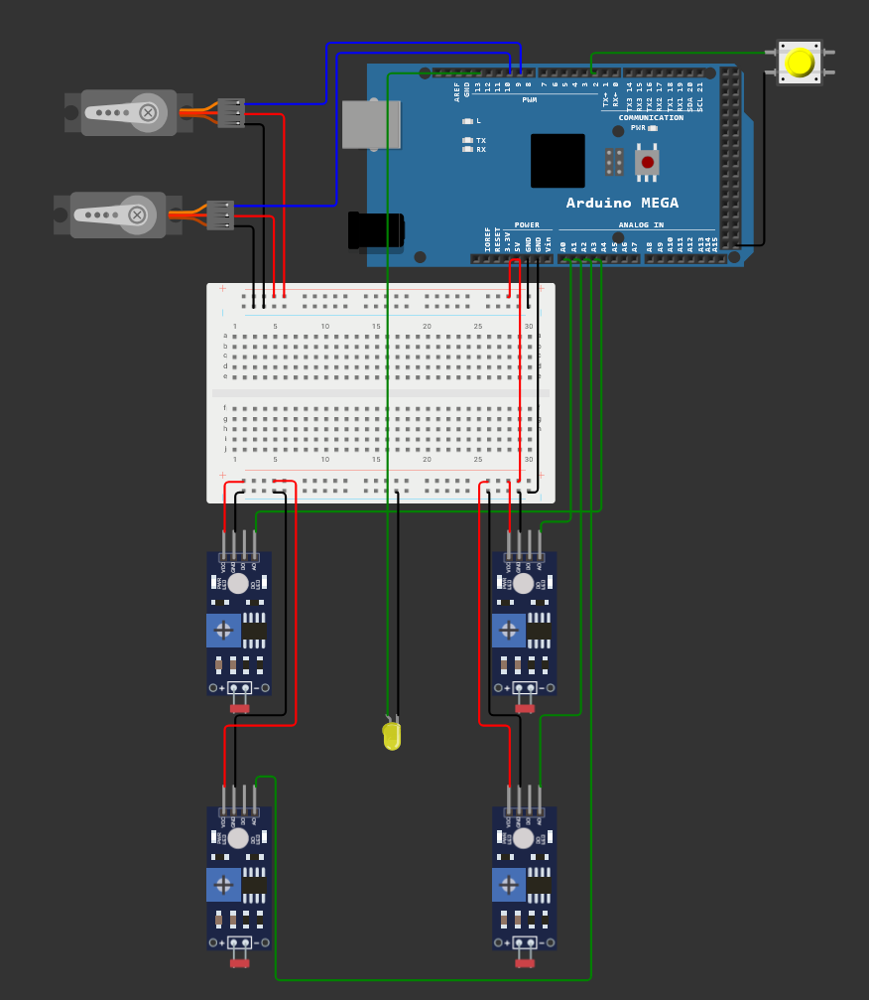

# Sustav za dvoosno praćenje solarnih panela

## Opis projekta

Ovaj projekt simulira dvoosno praćenje solarnih panela koristeći Arduino Mega 2560, LDR senzore za detekciju svjetlosti i servo motore za pomicanje panela. Sustav se uključuje i isključuje pomoću prekidača (tipkala), a kad je isključen, Arduino prelazi u sleep mode za uštedu energije. Sustav također omogućava optimizaciju energetskih resursa i automatski usmjerava panele ovisno o najjačem izvoru svjetlosti, čime poboljšava učinkovitost solarnih panela.

## Funkcionalni zahtjevi

| ID       | Funkcionalnost      | Opis                                                     |
| -------- | ------------------- | -------------------------------------------------------- |
| **FR-1** | Uključivanje sustava   | Sustav se ukluči pritiskom na tipkalo                 |
| **FR-2** | Isključivanje sustava  | Sustav se isključi pritiskom na tipkalo               |
| **FR-3** | Stanje sustava  | Stanje sustava se prikazuje LED diodom (ON/OFF)              |
| **FR-4** | Detektiranje svjetlosti  | Praćenje najjačeg izvora svjetlosti                 |
| **FR-5** | Praćenje svjetlosti  | Rotacija servo motora sustava ovisi o najjačem izvoru svjetlosti  |
| **FR-6** | Ušteda energije  | Ušteda energije implementacijom sleep mode funkcionalnosti  |

## Implementacija

| Komponenta | Arduino Mega 2560 Pin |
|-------------------|-------------------|
| Button | 2 |
| LED dioda  | 13 |
| LDR1  | A0 |
| LDR2 | A1 |
| LDR3 | A2 |
| LDR4 | A3 |
| Servo 1 | 9 |
| Servo 2 | 10 |

## Instalacija

### Za korištenje projekta u simulaciji, kliknite ovdje:

[*Sustav za dvoosno praćenje solarnih panela*](https://wokwi.com/projects/429448946340375553)

### Kako biste koristili ovaj projekt u realnom okruženju, morate imati sljedeće:
- Arduino IDE
- Biblioteka Servo instalirana u Arduino IDE-u
- Arduino Mega 2560
- LDR senzori (4 komada)
- 2 servo motora
- Prekidač (tipkalo)
- LED dioda
- Breadboard ploča
- Otpornici za LDR senzore (po potrebi)

### Kako koristiti
- Priključite sve komponente prema gore navedenoj shemi.
- Otvorite Arduino IDE i učitajte kod u Vašu Arduino Mega 2560 ploču.
- Pritisnite tipkalo za uključivanje sustava – LED dioda će pokazati da je sustav aktivan.
- Kretanje panela: Sustav će automatski pomaknuti solarne panele ovisno o najjačem izvoru svjetlosti.
- Pritisnite tipkalo ponovo za isključivanje sustava – Arduino će preći u sleep mode radi uštede energije.
